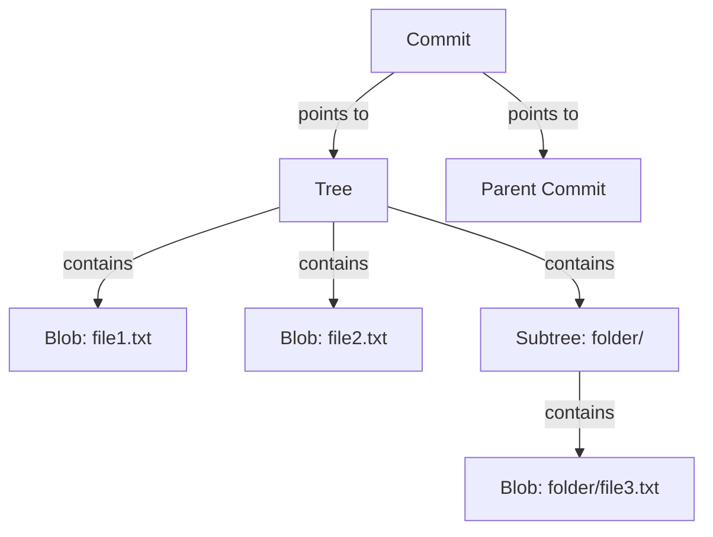

# gitfromscratch

A minimal implementation of Git, built from scratch in Python — to actually understand how Git works under the hood, instead of just using it.

> This is a **learning project**, not a replacement for Git. It reimplements Git's core ideas (object storage, staging, commits, branches) in a simplified way. Don't use it to manage real projects — use real Git for that!

## Why I built this

Every developer uses Git daily, but most of us treat it as a black box: `add`, `commit`, `push`, repeat. I wanted to actually understand what happens when you run those commands — what a commit *is*, why Git is so fast, and why history can't silently be tampered with.

Turns out Git's core idea is surprisingly simple: **everything is content, and content is identified by its own hash.** That one idea — a content-addressable store — is what this whole project is built around.

## How Git actually works (the short version)

Git stores everything as one of a few object types, each named after the SHA-1 hash of its own content:



- **Blob** — the raw content of a file (no name, just bytes)
- **Tree** — a directory listing: maps names to blobs/trees
- **Commit** — a snapshot: points to one tree + its parent commit + a message

Because objects are named after their own content's hash, identical content is only ever stored once — and any tampering with old history changes every hash after it, which is why Git history is essentially tamper-evident.

## Features implemented

- [x] `init` — create a new repository
- [x] `add` — stage files
- [x] `commit` — snapshot staged files
- [x] `log` — view commit history
- [x] `cat-file` — inspect any object by hash
- [x] `checkout` — restore files from any past commit
- [x] `status` — see what's changed
- [x] `branch` — create and list branches

## Usage

```bash
git clone https://github.com/<your-username>/gitfromscratch.git
cd gitfromscratch
pip install -e .

gfs init
echo "hello" > file.txt
gfs add file.txt
gfs commit -m "first commit"
gfs log
```

## Project structure

```
gitfromscratch/
├── gitfromscratch/
│   ├── repo.py       # repository setup (init)
│   ├── objects.py    # blob/tree/commit storage (the core!)
│   ├── index.py       # staging area
│   ├── refs.py         # HEAD, branches
│   └── cli.py           # command-line interface
├── tests/
└── README.md
```

## What I learned

*(filling this in as I build — genuine takeaways go here, not just a feature list)*

## Credits / inspiration

- [Write Yourself a Git](https://wyag.thb.lt/) by Thibault Polge — a much deeper, git-compatible version of this same idea, worth reading after this one.
